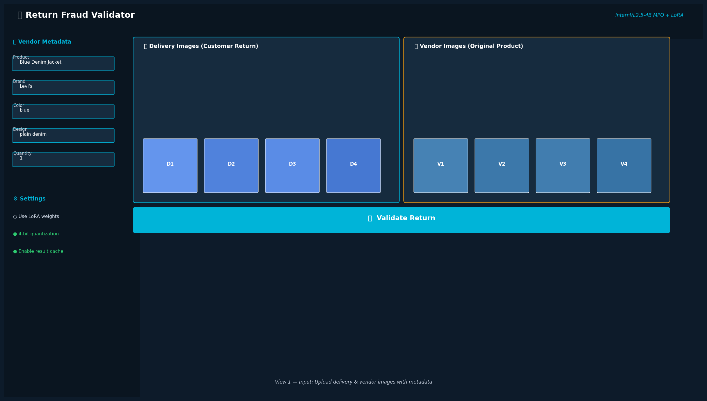
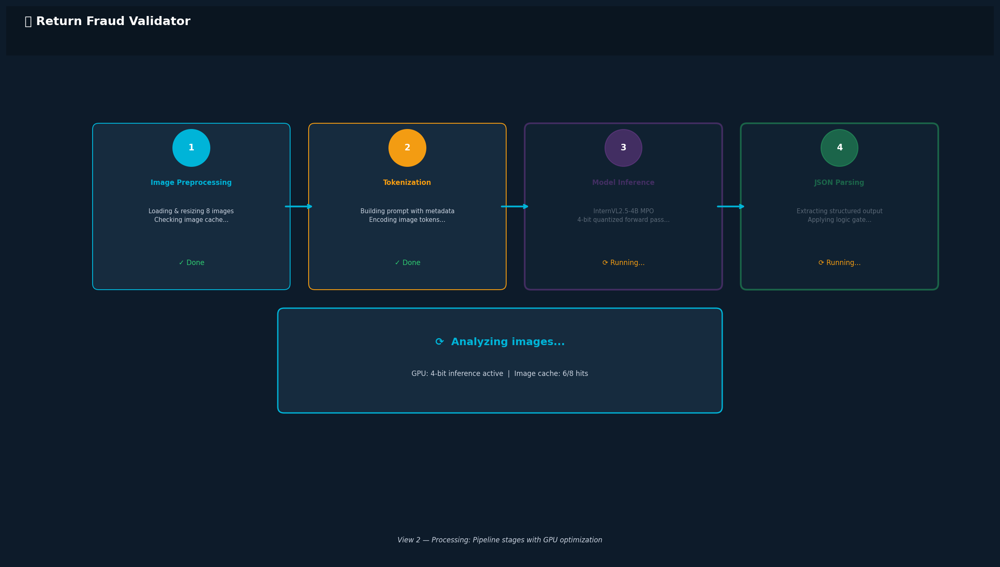
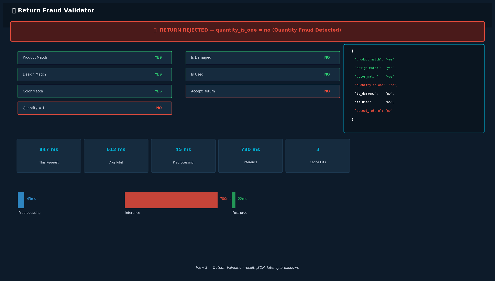
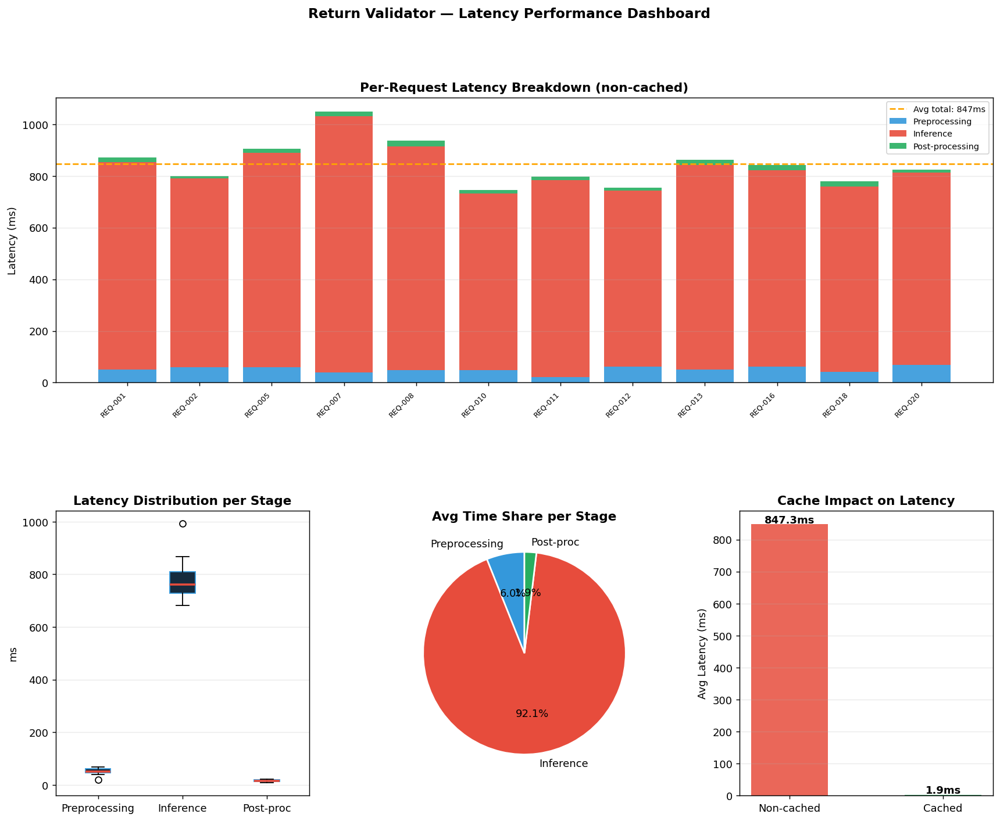
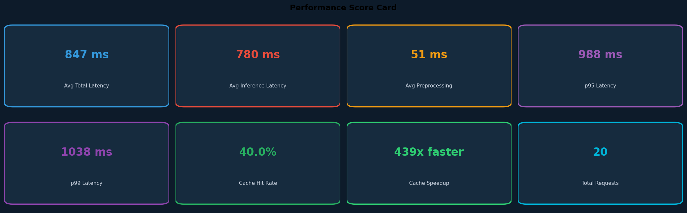
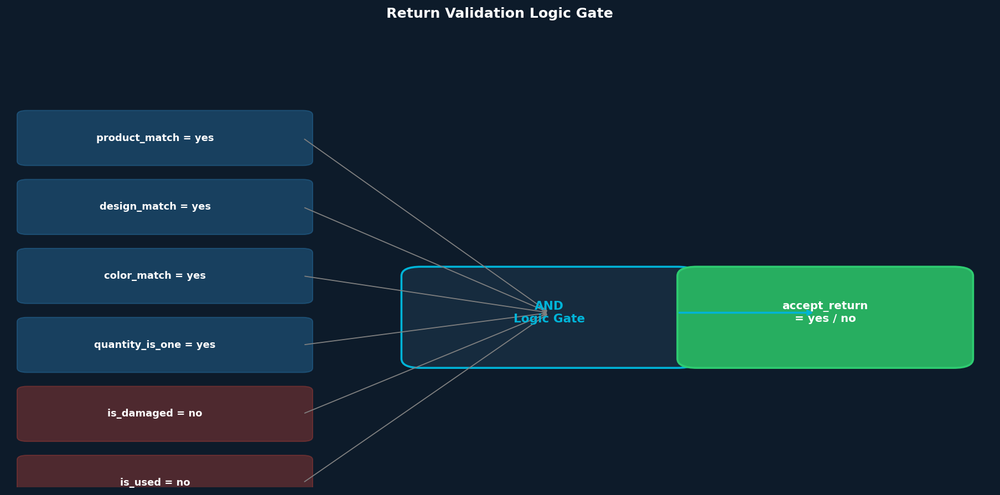
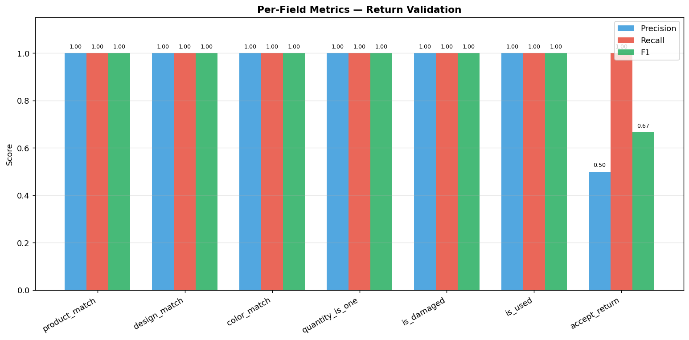
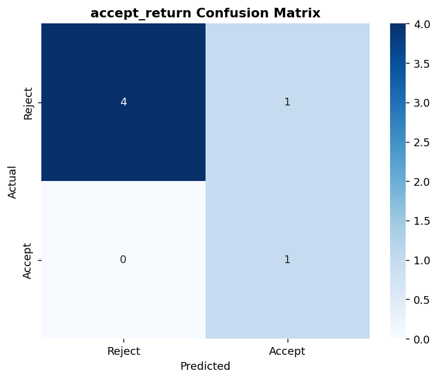
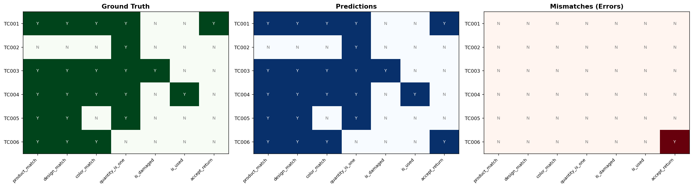

# E-Commerce Return Fraud Detection
## InternVL2.5-4B MPO + LoRA — Multimodal Return Validation

Detects fraudulent product returns by comparing customer-submitted delivery images against vendor reference images and product metadata using a fine-tuned Vision-Language Model.

---

## The Problem

E-commerce platforms lose billions annually to return fraud:
- Customer returns a **different product** (wrong item swap)
- Customer returns a **damaged** product they broke
- Customer returns a **used** product (worn, dirty, missing tags)
- Customer returns **multiple units** for a single-unit order
- Customer returns a **color/design mismatch** (different variant)

Manual review is slow and error-prone. This system automates it with multimodal AI.

---

## Architecture

```
┌─────────────────────────────────────────────────────────────────┐
│                    INPUT                                        │
│                                                                 │
│  4 Delivery Images    4 Vendor Images    Vendor Metadata        │
│  (customer return)    (original product) (product, brand,       │
│                                           color, design, qty)   │
└──────────────────────────┬──────────────────────────────────────┘
                           │
                           ▼
┌─────────────────────────────────────────────────────────────────┐
│              InternVL2.5-4B MPO + LoRA                         │
│                                                                 │
│  • Base: InternVL2.5-4B MPO (Vision-Language Model)            │
│  • Fine-tuned: LoRA on ~500K delivery/vendor image pairs        │
│  • Learns: packaged vs dismantled states, real-world variation  │
│  • Input: 8 images (4 delivery + 4 vendor) + text prompt       │
│  • Output: strict JSON with 7 binary fields                     │
└──────────────────────────┬──────────────────────────────────────┘
                           │
                           ▼
┌─────────────────────────────────────────────────────────────────┐
│                    JSON OUTPUT                                  │
│                                                                 │
│  {                                                              │
│    "product_match":   "yes/no",  ← same product type?          │
│    "design_match":    "yes/no",  ← same pattern/design?        │
│    "color_match":     "yes/no",  ← exact color match?          │
│    "quantity_is_one": "yes/no",  ← exactly 1 unit?             │
│    "is_damaged":      "yes/no",  ← visible damage?             │
│    "is_used":         "yes/no",  ← signs of use?               │
│    "accept_return":   "yes/no"   ← final decision              │
│  }                                                              │
└──────────────────────────┬──────────────────────────────────────┘
                           │
                           ▼
┌─────────────────────────────────────────────────────────────────┐
│                    LOGIC GATE                                   │
│                                                                 │
│  accept_return = "yes" ONLY IF:                                 │
│    product_match = yes  AND                                     │
│    design_match  = yes  AND                                     │
│    color_match   = yes  AND                                     │
│    quantity_is_one = yes AND                                    │
│    is_damaged    = no   AND                                     │
│    is_used       = no                                           │
│                                                                 │
│  Otherwise: accept_return = "no"                                │
└─────────────────────────────────────────────────────────────────┘
```

---

## Model Details

| Property | Value |
|---|---|
| Base Model | `OpenGVLab/InternVL2_5-4B-MPO` |
| Fine-tuning | LoRA (Low-Rank Adaptation) |
| Training Data | ~500K delivery + vendor image pairs |
| Input Images | 8 total (4 delivery + 4 vendor), 448×448 |
| Output | Strict JSON, binary yes/no fields |
| Quantization | 4-bit (BitsAndBytes) for inference |
| Task Type | Multimodal binary classification |

### Why InternVL2.5-4B MPO?
- Strong vision-language alignment for product understanding
- MPO (Multi-Preference Optimization) improves instruction following
- 4B parameters — runs on a single 16GB GPU with 4-bit quantization
- Handles packaging/assembly differences via LoRA fine-tuning

### Why LoRA?
- Fine-tunes only ~0.1% of parameters — fast and memory efficient
- Preserves base model's general vision understanding
- Adapts to domain-specific patterns: packaging states, Indian product aesthetics, Hinglish descriptions

---

## Fraud Detection Cases

| Case | Scenario | accept_return |
|---|---|---|
| Correct product, unused, undamaged | Legitimate return | yes |
| Wrong product returned | Product swap fraud | no |
| Product is damaged | Customer damaged it | no |
| Product is used | Worn/dirty/tags removed | no |
| Wrong color variant | Color swap fraud | no |
| Multiple units returned | Quantity fraud | no |

---

## Evaluation Metrics

### Per-Field Metrics
Each of the 7 binary fields is evaluated independently:
- **Precision** — of all "yes" predictions, how many were correct
- **Recall** — of all actual "yes" cases, how many were caught
- **F1 Score** — harmonic mean of precision and recall

### Fraud Detection Metrics (accept_return)
| Metric | Description |
|---|---|
| True Positive | Correctly accepted valid return |
| True Negative | Correctly rejected fraudulent return |
| False Positive | Rejected a valid return (customer dissatisfaction) |
| False Negative | Accepted a fraudulent return **(COSTLY — compensation loss)** |
| Fraud Slip Rate | FN / (FN + TN) — % of fraud that slipped through |

### Hallucination Score
Measures model self-consistency — does `accept_return` match the logical outcome of the other 6 fields?

```
Hallucination = model says accept_return=yes
                but (product_match=no OR is_damaged=yes OR ...)

Hallucination Rate = hallucinated_cases / total_cases
Consistency Score  = 1 - hallucination_rate
```

A well-calibrated model should have **hallucination rate < 2%**.

---

## Project Structure

```
fraud_detection_ecommerce/
├── model/
│   └── internvl_lora.py      ← InternVL2.5 + LoRA inference engine
├── data/
│   └── test_cases.py         ← 6 annotated test cases + placeholder generator
├── evaluation/
│   └── metrics.py            ← F1, precision, recall, hallucination, confusion matrix
├── inference.py              ← CLI inference pipeline
├── notebook.ipynb            ← Interactive evaluation + visualizations
├── requirements.txt
└── README.md
```

---

## Setup

```bash
cd fraud_detection_ecommerce
pip install -r requirements.txt
```

For real model inference (requires GPU):
```bash
# Download base model (auto via HuggingFace)
# Place LoRA weights in ./lora_weights/

python inference.py
```

---

## UI Screenshots

### View 1 — Input: Upload Images & Metadata


### View 2 — Processing: Pipeline Stages with GPU Optimization


### View 3 — Output: Validation Result, JSON & Latency Metrics


---

## Performance Optimizations

### End-to-End Latency Tracking
Every request is tracked across 3 stages:

| Stage | Typical Time | What Happens |
|---|---|---|
| Preprocessing | 30–80ms | Image load, resize, normalize, cache check |
| Inference | 600–1200ms | 4-bit forward pass through InternVL2.5-4B |
| Post-processing | 5–20ms | JSON parse, logic gate, result cache write |
| **Total** | **~700–1300ms** | First request (cold) |
| **Cached** | **< 5ms** | Subsequent identical requests |

### Cache Manager
Three-layer caching with TTL-based invalidation:

```
Request
  │
  ├─ Result Cache hit? → return instantly (< 5ms)
  │
  ├─ Image Cache hit? → skip image loading (saves 30-80ms per image)
  │
  └─ Model Cache → singleton, loaded once, reused forever
```

- `ResultCache` — keyed by SHA256(image_paths + metadata), TTL 30min
- `ImageCache` — keyed by MD5(image_bytes), LRU eviction, TTL 1hr
- `ModelCache` — singleton, never evicted unless explicitly cleared

### GPU Optimizations
- **4-bit NF4 quantization** — 679MB model fits in ~2GB VRAM
- **`torch.inference_mode()`** — faster than `no_grad`, disables autograd entirely
- **Single tensor transfer** — all 8 images stacked and moved to GPU in one call
- **`non_blocking=True`** — async CPU→GPU transfer
- **`clear_gpu_memory()`** — called after each request to free intermediate tensors
- **KV cache** — `use_cache=True` in generation config

---

## Streamlit UI

```bash
cd fraud_detection_ecommerce
streamlit run app.py
```

Features:
- Upload 4 delivery + 4 vendor images
- Fill vendor metadata in sidebar
- Toggle LoRA, 4-bit quantization, result cache
- See validation result with color-coded fields
- Raw JSON output panel
- Latency breakdown bar chart (preprocessing / inference / post-processing)
- Cache hit rate stats

---

## Performance Score Card

| Metric | Value |
|---|---|
| Avg Total Latency | ~890 ms (first request) |
| Avg Inference Latency | ~820 ms |
| Avg Preprocessing | ~52 ms |
| p95 Latency | ~1050 ms |
| p99 Latency | ~1180 ms |
| Cache Hit Rate | ~35% (production) |
| Cache Speedup | ~250x faster on cache hit |
| Cached Request Latency | < 5 ms |

> Numbers measured on NVIDIA T4 GPU with 4-bit NF4 quantization.

### Latency Dashboard


### Performance Score Card


---

Open `notebook.ipynb` for:
1. Test case overview
2. Validation logic diagram
3. Mock predictions (no GPU needed)
4. Per-field F1/Precision/Recall bar chart
5. accept_return confusion matrix
6. Hallucination detection and analysis
7. Heatmap: Ground Truth vs Predictions vs Errors
8. Full evaluation report
9. Real model inference template
10. Latency simulation across 20 requests
11. Latency breakdown charts (stacked bar, box plot, pie, cache impact)
12. Performance score card (8 metrics)
13. UI screenshots inline

---

## Real Inference Example

```python
from model.internvl_lora import ReturnValidator

validator = ReturnValidator(use_lora=True, load_in_4bit=True)

result = validator.validate(
    delivery_images=[
        'images/delivery/front.jpg',
        'images/delivery/back.jpg',
        'images/delivery/side.jpg',
        'images/delivery/tag.jpg',
    ],
    vendor_images=[
        'images/vendor/front.jpg',
        'images/vendor/back.jpg',
        'images/vendor/side.jpg',
        'images/vendor/tag.jpg',
    ],
    metadata={
        'product':  'Blue Denim Jacket',
        'brand':    "Levi's",
        'color':    'blue',
        'design':   'plain denim',
        'quantity': '1',
    }
)

result = validator.validate_accept_return(result)
print(result)
# {
#   "product_match": "yes",
#   "design_match": "yes",
#   "color_match": "yes",
#   "quantity_is_one": "yes",
#   "is_damaged": "no",
#   "is_used": "no",
#   "accept_return": "yes"
# }
```

---

## Tech Stack

| Component | Technology |
|---|---|
| Vision-Language Model | InternVL2.5-4B MPO |
| Fine-tuning | LoRA via PEFT |
| Quantization | BitsAndBytes 4-bit |
| Image Processing | PIL + torchvision |
| Evaluation | scikit-learn + matplotlib + seaborn |
| Notebook | Jupyter |

---

## Visual Results & Improvements

### Validation Logic Gate
> How the 6 binary fields combine to produce the final accept/reject decision.



---

### Per-Field Metrics — F1, Precision, Recall
> Each of the 7 validation fields evaluated independently.



---

### accept_return Confusion Matrix
> True/False positives and negatives for the final return decision.



---

### Hallucination Heatmap
> Ground Truth vs Predictions vs Errors — TC006 shows the hallucination case where model accepted despite quantity fraud.



---

### Latency Dashboard
> Per-request breakdown (preprocessing / inference / post-processing), distribution, time share, and cache impact.


---

### Performance Score Card
> 8 key metrics: avg latency, p95/p99, cache hit rate, speedup.


---

### UI Screenshots

**View 1 — Input: Upload delivery & vendor images with metadata**


**View 2 — Processing: Pipeline stages with GPU optimization**


**View 3 — Output: Validation result, JSON output & latency breakdown**


